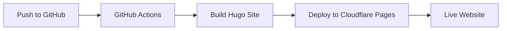

# Continuous Delivery: GitHub to Cloudflare Pages

This document provides detailed instructions for setting up continuous delivery from GitHub to Cloudflare Pages for the Bradley Goetsch personal website.

## Overview



The continuous delivery pipeline automatically builds and deploys your Hugo site whenever changes are pushed to the main branch of your GitHub repository.

## Prerequisites

- GitHub repository for your Hugo site
- Cloudflare account
- Basic familiarity with GitHub Actions

## Step 1: Set Up Cloudflare Pages

1. **Create a Cloudflare Account** (if you don't have one)
   - Go to [Cloudflare's website](https://dash.cloudflare.com/sign-up)
   - Follow the sign-up process

2. **Create a New Cloudflare Pages Project**
   - Log in to your Cloudflare dashboard
   - Navigate to "Pages" in the sidebar
   - Click "Create a project" → "Connect to Git"
   - Select your GitHub repository (goetsch-site)
   - Authorize Cloudflare to access your GitHub account if prompted

3. **Configure Build Settings**
   - Set build command: `npm run build`
   - Set build output directory: `public`
   - Add environment variables:
     - `HUGO_VERSION`: `0.145.0` (or your current version)
   - Click "Save and Deploy"

4. **Initial Manual Deployment**
   - Cloudflare will perform an initial build and deployment
   - This may take a few minutes
   - Once complete, your site will be available at a Cloudflare-provided URL (e.g., `your-project-name.pages.dev`)

## Step 2: Create GitHub Actions Workflow

1. **Create Workflow Directory** (if it doesn't exist)
   - Create a `.github/workflows` directory in your repository

2. **Create Workflow File**
   - Create a file named `deploy.yml` in the `.github/workflows` directory with the following content:

```yaml
name: Deploy to Cloudflare Pages

on:
  push:
    branches:
      - main  # or master, depending on your default branch

jobs:
  deploy:
    runs-on: ubuntu-latest
    steps:
      - uses: actions/checkout@v3
        with:
          submodules: true  # Fetch Hugo themes (if used)
          fetch-depth: 0    # Fetch all history for .GitInfo and .Lastmod

      - name: Setup Hugo
        uses: peaceiris/actions-hugo@v2
        with:
          hugo-version: '0.145.0'
          extended: true

      - name: Setup Node
        uses: actions/setup-node@v3
        with:
          node-version: '18'
          cache: 'npm'

      - name: Install dependencies
        run: npm ci

      - name: Build
        run: npm run build

      - name: Deploy to Cloudflare Pages
        uses: cloudflare/pages-action@v1
        with:
          apiToken: ${{ secrets.CLOUDFLARE_API_TOKEN }}
          accountId: ${{ secrets.CLOUDFLARE_ACCOUNT_ID }}
          projectName: goetsch-site  # Your Cloudflare Pages project name
          directory: public
          gitHubToken: ${{ secrets.GITHUB_TOKEN }}
```

## Step 3: Set Up GitHub Secrets

1. **Generate Cloudflare API Token**
   - Go to your Cloudflare dashboard
   - Navigate to "My Profile" → "API Tokens"
   - Click "Create Token"
   - Select "Create Custom Token"
   - Name it "GitHub Actions Deployment"
   - Under "Permissions", add:
     - Account > Cloudflare Pages > Edit
     - Account > Account Settings > Read
   - Under "Account Resources", select your account
   - Click "Continue to summary" then "Create Token"
   - **Copy the token immediately** (it will only be shown once)

2. **Find Your Cloudflare Account ID**
   - In your Cloudflare dashboard, look at the URL
   - It should be in the format: `https://dash.cloudflare.com/ACCOUNT_ID`
   - Copy the `ACCOUNT_ID` portion

3. **Add Secrets to GitHub Repository**
   - Go to your GitHub repository
   - Navigate to "Settings" → "Secrets and variables" → "Actions"
   - Click "New repository secret"
   - Add the following secrets:
     - Name: `CLOUDFLARE_API_TOKEN`, Value: your Cloudflare API token
     - Name: `CLOUDFLARE_ACCOUNT_ID`, Value: your Cloudflare account ID

## Step 4: Custom Domain Setup (Optional)

1. **Add Custom Domain in Cloudflare Pages**
   - Go to your Cloudflare Pages project
   - Click "Custom domains"
   - Click "Set up a custom domain"
   - Enter your domain (e.g., `goetsch.xyz`)
   - Click "Continue"

2. **Configure DNS**
   - If your domain is already managed by Cloudflare, select "Cloudflare managed DNS"
   - If not, you'll need to add the provided CNAME record to your DNS provider
   - Follow the on-screen instructions to verify domain ownership

3. **Verify Domain Connection**
   - Once DNS propagation is complete, your custom domain will be active
   - This may take up to 24 hours, but often happens much faster

## Step 5: Testing the Workflow

1. **Make a Small Change**
   - Edit a file in your repository
   - Commit and push to your main branch

2. **Monitor Workflow Execution**
   - Go to your GitHub repository
   - Click on the "Actions" tab
   - You should see your workflow running
   - Wait for it to complete

3. **Verify Deployment**
   - Once the workflow completes successfully, visit your Cloudflare Pages URL
   - Verify that your changes are visible

## Troubleshooting

### Common Issues

1. **Build Failures**
   - Check the GitHub Actions logs for specific error messages
   - Verify that your Hugo version in the workflow matches the one you use locally
   - Ensure all dependencies are properly installed

2. **Deployment Failures**
   - Verify that your API token has the correct permissions
   - Check that your account ID is correct
   - Ensure your project name in the workflow matches the one in Cloudflare Pages

3. **Custom Domain Issues**
   - Verify DNS configuration is correct
   - Check for SSL/TLS certificate errors
   - Ensure your domain is properly verified

### Getting Help

- Cloudflare Pages documentation: [https://developers.cloudflare.com/pages/](https://developers.cloudflare.com/pages/)
- GitHub Actions documentation: [https://docs.github.com/en/actions](https://docs.github.com/en/actions)
- Hugo documentation: [https://gohugo.io/documentation/](https://gohugo.io/documentation/)

## Benefits of This Setup

- **Automated Deployments**: Every push to main will trigger a build and deployment
- **Preview Deployments**: Cloudflare Pages automatically creates preview deployments for PRs
- **Fast Global CDN**: Cloudflare's global CDN ensures your site loads quickly worldwide
- **Free SSL**: Automatic HTTPS for your site
- **Analytics**: Basic analytics through Cloudflare

## Next Steps

After setting up continuous delivery, consider:

1. **Branch Protection Rules**: Require PR reviews before merging to main
2. **Preview Environments**: Leverage Cloudflare's preview deployments for PRs
3. **Custom Build Scripts**: Enhance your build process with additional steps
4. **Performance Monitoring**: Set up monitoring for your deployed site
