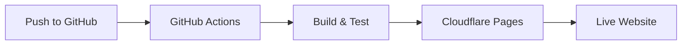

# Hybrid CI/CD: GitHub Actions + Cloudflare Pages

This document outlines the hybrid CI/CD approach implemented for the Bradley Goetsch personal website, combining GitHub Actions for testing and Cloudflare Pages for deployment.

## Overview

This hybrid approach provides several benefits:
- **Security**: Reduces attack surface by separating testing and deployment
- **Automation**: Maintains CI/CD testing and validation before deploying
- **Flexibility**: Can be expanded or refined based on real-world needs

## Components

### 1. GitHub Actions for Testing

The `.github/workflows/test.yml` file defines a workflow that:
- Runs on every push to main and on pull requests
- Sets up Hugo and Node.js
- Installs dependencies
- Builds the site
- Performs security scanning
- Can be extended with linting, testing, and link checking

This ensures that code quality and security are maintained without giving GitHub Actions deployment permissions.

### 2. Cloudflare Pages for Deployment

Cloudflare Pages is configured to:
- Connect directly to the GitHub repository
- Watch for changes to the main branch
- Build and deploy the site automatically
- Provide preview deployments for pull requests

## Setup Instructions

### GitHub Actions Setup

The GitHub Actions workflow is already set up in `.github/workflows/test.yml`. You can extend it by:
- Uncommenting and configuring the linting step
- Uncommenting and configuring the testing step
- Adding additional security scanning tools
- Implementing the webhook notification to trigger Cloudflare deployments

### Cloudflare Pages Setup

1. **Connect Your Repository**:
   - Go to Cloudflare Dashboard > Pages
   - Click "Create a project"
   - Select "Connect to Git"
   - Choose your GitHub repository
   - Authorize Cloudflare to access your repository

2. **Configure Build Settings**:
   - Build command: `npm run build`
   - Build output directory: `public`
   - Environment variables:
     - `HUGO_VERSION`: `0.145.0` (or your current version)

3. **Set Up Branch Deployments**:
   - Production branch: `main`
   - Preview branches: `*` (all branches)

## Webhook Integration (Optional)

To ensure Cloudflare only deploys after successful GitHub Actions runs:

1. **Create a Cloudflare API Token**:
   - Go to Cloudflare Dashboard > My Profile > API Tokens
   - Create a token with Pages permissions

2. **Update GitHub Actions Workflow**:
   - Uncomment and configure the webhook notification step in `.github/workflows/test.yml`
   - Add your Cloudflare API token as a GitHub secret

3. **Configure Webhook Endpoint**:
   - Create a Cloudflare Worker to receive the webhook
   - Validate the webhook payload
   - Trigger a deployment using the Cloudflare API

## Security Considerations

- **API Tokens**: Store all API tokens as GitHub secrets
- **Minimal Permissions**: Use the principle of least privilege for all tokens
- **Webhook Security**: Implement signature validation for webhooks
- **Branch Protection**: Enable branch protection rules for the main branch

## Maintenance and Troubleshooting

### Common Issues

1. **Failed Builds**:
   - Check GitHub Actions logs for build errors
   - Verify that dependencies are up to date
   - Ensure Hugo version is consistent between local and CI environments

2. **Failed Deployments**:
   - Check Cloudflare Pages logs for deployment errors
   - Verify that build settings are correct
   - Ensure Cloudflare has access to your repository

### Updating the Workflow

When updating the CI/CD workflow:
1. Test changes in a branch first
2. Use pull requests to review workflow changes
3. Monitor the first few runs after changes to ensure everything works

## Future Enhancements

- **Automated Rollbacks**: Implement automatic rollbacks if a deployment fails
- **Self-hosted Runners**: Use self-hosted GitHub Actions runners for more control
- **Enhanced Security Scanning**: Add additional security tools to the workflow
- **Performance Testing**: Add performance testing to the workflow
- **Cloudflare Workers**: Implement edge functions for enhanced functionality
