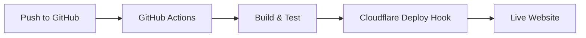

# Hybrid CI/CD: GitHub Actions + Cloudflare Pages Deploy Hooks

This document outlines the hybrid CI/CD approach implemented for the Bradley Goetsch personal website, combining GitHub Actions for testing and Cloudflare Pages Deploy Hooks for deployment.

## Overview

This hybrid approach provides several benefits:
- **Enhanced Security**: Uses Deploy Hooks instead of API tokens
- **Separation of Concerns**: Testing and deployment are separate processes
- **Simplified Workflow**: Clear job dependencies and conditions
- **Reduced Attack Surface**: Minimal permissions for each component

## Components

### 1. GitHub Actions CI/CD Pipeline

The `.github/workflows/deploy.yml` file defines a workflow that:
- Runs on every push to main and on pull requests
- Has two separate jobs: build-and-test and deploy
- Only triggers deployment after successful tests
- Uses Cloudflare Deploy Hooks for secure deployments

### 2. Cloudflare Pages Deploy Hooks

Cloudflare Pages Deploy Hooks:
- Provide a secure way to trigger deployments without API tokens
- Generate unique URLs that can be called to start a deployment
- Can be restricted to specific branches
- Simplify the deployment process

## Setup Instructions

### 1. Configure Cloudflare Deployment Webhook

1. **Create a Deploy Hook**:
   - Go to Cloudflare Dashboard → Pages
   - Select your Cloudflare Pages project
   - Click Settings → Deployments
   - Scroll down to "Deploy Hooks" and click "Create Deploy Hook"
   - Name it something like "GitHub Auto-Deploy"
   - Select the branch to deploy (main)
   - Copy the Webhook URL

2. **Add Webhook URL as a GitHub Secret**:
   - Go to GitHub → Your Repository → Settings → Secrets and Variables → Actions
   - Click New Repository Secret
   - Name: `CLOUDFLARE_DEPLOY_HOOK`
   - Value: (Paste the webhook URL copied from Cloudflare)
   - Click Add secret

### 2. GitHub Actions Workflow

The GitHub Actions workflow is already set up in `.github/workflows/deploy.yml`. You can extend it by:
- Uncommenting and configuring the testing step
- Adding additional security scanning tools
- Implementing notification systems (Slack, Email, etc.)

## Security Considerations

- **No API Tokens**: Deploy Hooks eliminate the need for API tokens
- **Conditional Deployment**: Deployment only happens after successful tests
- **Minimal Permissions**: GitHub Actions has no direct access to Cloudflare
- **Branch Protection**: Enable branch protection rules for the main branch

## Maintenance and Troubleshooting

### Common Issues

1. **Failed Builds**:
   - Check GitHub Actions logs for build errors
   - Verify that dependencies are up to date
   - Ensure Hugo version is consistent between local and CI environments

2. **Failed Deployments**:
   - Check if the Deploy Hook is correctly configured
   - Verify the Deploy Hook URL is correctly stored as a GitHub secret
   - Check Cloudflare Pages logs for deployment errors

### Updating the Workflow

When updating the CI/CD workflow:
1. Test changes in a branch first
2. Use pull requests to review workflow changes
3. Monitor the first few runs after changes to ensure everything works

## Future Enhancements

- **Status Notifications**: Add Slack or email notifications for build/deploy status
- **Automated Rollbacks**: Implement automatic rollbacks if a deployment fails
- **Self-hosted Runners**: Use self-hosted GitHub Actions runners for more control
- **Enhanced Security Scanning**: Add additional security tools to the workflow
- **Performance Testing**: Add performance testing to the workflow
